# Fronius Smart Meter Emulator für zwei Shelly-PV-Anlagen

Dieses Projekt liest bis zu zwei Shelly Plugs per HTTP aus und stellt ihre
gemeinsame Erzeugung als Fronius-kompatiblen SunSpec-Zähler über Modbus TCP
bereit. Standard ist das verlangte Float-Modell 213; ein vollständiges
Integer-/Scale-Factor-Modell 203 ist nur als manuell wählbarer
Kompatibilitätsfallback enthalten. Der vorhandene physische Fronius Smart Meter bleibt der
einzige Primärzähler am Netzanschlusspunkt. Der emulierte Zähler wird am
Fronius Verto Plus als zusätzlicher Erzeugungszähler eingebunden.

Der vorgesehene Betrieb ist ein Portainer-Git-Stack auf einer Ubuntu-VM. Der
Container läuft ohne Root-Rechte auf TCP-Port 1502; Docker veröffentlicht ihn
standardmäßig auf Port 502 der VM.

> **Wichtig:** Dies ist ein unabhängiger Emulator, keine von Fronius
> freigegebene oder zertifizierte Zählerimplementierung. Die Verto-Unterstützung
> für sekundäre Modbus-TCP-Produktionszähler ist dokumentiert; die konkrete
> Registeremulation muss dennoch an der realen Anlage abgenommen werden.

## Grundsätzliche Arbeitsweise und Kommunikationsrichtung

Die Kommunikation arbeitet auf beiden Seiten nach dem **Pull-Prinzip**:

1. Der Emulator ist HTTP-Client und fragt beide Shellys aktiv ab. Die Shellys
   senden von sich aus nichts an den Emulator.
2. Der Verto ist Modbus-TCP-Client und liest aktiv die Register des Emulators.
   Der Emulator baut keine Verbindung zum Verto auf.
3. Solar.web erhält seine Mess- und Statistikdaten vom Verto. Der Emulator
   kommuniziert weder direkt mit Solar.web noch mit der Fronius-Cloud.

```mermaid
flowchart LR
    H1["Hoymiles 1"] --> S1["Shelly 1<br/>Plus Plug S Gen2"]
    H2["Hoymiles 2"] --> S2["Shelly 2<br/>Plug M Gen3"]

    subgraph EMU["Emulator auf der Ubuntu-VM"]
        POLL["HTTP-Poller<br/>alle 2 Sekunden"]
        NORM["Validierung und Normalisierung<br/>Richtung, Schwellwert, U/I/f/VA/PF"]
        STATE["Persistenter Energie-State<br/>Shelly-Rohwert + Reset-Offset"]
        AGG["Aggregation nach L1/L2/L3"]
        SUN["Atomarer SunSpec-Snapshot<br/>Meter Model 213 oder 203"]
        MB["Read-only Modbus-TCP-Server<br/>FC03, Unit-ID 2"]

        POLL --> NORM
        NORM -- "Momentanwerte" --> AGG
        NORM -- "Hardware-Energiezähler" --> STATE
        STATE -- "monotone virtuelle Wh" --> AGG
        AGG --> SUN --> MB
    end

    POLL -- "HTTP GET: Switch.GetStatus" --> S1
    POLL -- "HTTP GET: Switch.GetStatus" --> S2
    S1 -. "JSON-Statusantwort" .-> POLL
    S2 -. "JSON-Statusantwort" .-> POLL

    V["Fronius Verto Plus<br/>Modbus-TCP-Client"]
    WEB["Fronius Solar.web"]

    V -- "FC03-Leseanfrage" --> MB
    MB -. "SunSpec-Registerantwort" .-> V
    V -- "Monitoringdaten" --> WEB
```



### Momentanwerte und Energiezähler

Ein Shelly-Payload enthält zwei grundsätzlich unterschiedliche Wertarten:

| Wertart | Beispiele | Bedeutung |
|---|---|---|
| Momentanwerte | `apower`, `voltage`, `current`, `freq`, `pf` | Zustand zum Zeitpunkt der HTTP-Abfrage |
| Hardware-Energiezähler | `aenergy.total`, `ret_aenergy.total` | Seit dem Zählerstart kumulierte Wirkenergie in Wh |

Der Emulator integriert die Wattwerte absichtlich **nicht** selbst über die
Zeit. Für Energie verwendet er den kumulativen Hardwarezähler des jeweiligen
Shellys. Dadurch kann eine während eines Emulatorausfalls weitergezählte
Energiemenge nach der Wiederkehr normalerweise übernommen werden, ohne die
fehlenden einzelnen Watt-Samples schätzen zu müssen.

Für die bekannte Anlage wird positives `apower` von Shelly 1 direkt als
Erzeugung verwendet. Das negative `apower` von Shelly 2 wird in eine positive
Erzeugungsleistung gedreht. Werte unter `MIN_POWER_W` werden bei den
Momentanwerten als Messrauschen auf 0 gesetzt; der Hardware-Energiezähler wird
davon unabhängig weiter ausgewertet.

Beide Shellys werden parallel abgefragt. Anschließend werden entsprechend der
konfigurierten Phase:

- Wirkleistung W, Strom A und Scheinleistung VA addiert;
- Spannungen und vorhandene Frequenzwerte gemittelt;
- virtuelle Wh-Zähler je Phase und anschließend als Gesamtenergie addiert.

Beide vorhandenen Anlagen liegen auf L1. Deshalb trägt L1 ihre gemeinsame
Leistung und Energie; L2 und L3 bleiben bei Leistung und Strom 0. Aus jedem
Aggregationsergebnis wird ein vollständiger Registersatz erzeugt und atomar
ausgetauscht. Eine Verto-Anfrage sieht damit entweder den vorherigen oder den
neuen vollständigen Snapshot, niemals einen halb aktualisierten Mischstand.

### Verhalten bei Ausfällen und Nachholeffekt

| Situation | Momentanleistung | Kumulative Energie |
|---|---|---|
| Einzelner kurzer Shelly-Fehler | Letzter guter Wert bleibt bis zu 10 s aktiv | Letzter Stand bleibt erhalten |
| Shelly länger als 10 s nicht erreichbar | Betroffene Quelle fällt auf 0 W/A/VA | Zähler fällt nicht zurück |
| Container oder Ubuntu-VM aus | Modbus ist für den Verto nicht erreichbar | Shellys können unabhängig weiterzählen |
| Erster erfolgreicher Poll nach Wiederkehr | Aktueller Momentanwert erscheint | Differenz des Shelly-Hardwarezählers wird übernommen |
| State-Datei verloren | Momentanwerte funktionieren nach dem ersten Poll | Aktuelle Shelly-Stände helfen, frühere Reset-Offsets können verloren sein |

Beispiel: Vor einem VM-Ausfall meldet ein Shelly 1000 Wh. Während des Ausfalls
zählt er weitere 800 Wh und meldet danach 1800 Wh. Beim ersten erfolgreichen
Poll übernimmt der Emulator den neuen Stand; die 800 Wh fehlen damit nicht im
kumulativen virtuellen Energiezähler.

Nicht nachholbar ist der historische Verlauf der Momentanleistung. Der Emulator
besitzt keine Watt-Zeitreihe und keine rückwirkende Übertragungsschnittstelle.
Der Verto sieht nach einer Lücke nur den aktuellen Momentanwert und den höheren
Wh-Gesamtstand. Wie Verto und Solar.web diesen Sprung einem Zeitintervall oder
Kalendertag zuordnen, liegt außerhalb des Emulators. Eine minutengenaue
Leistungskurve kann rückwirkend nicht rekonstruiert werden.

Springt derselbe Shelly-Hardwarezähler deutlich zurück, behandelt der Emulator
dies als Reset und setzt einen persistenten Offset, sodass sein virtueller
Zähler nicht fällt. Bei einem bewussten Wechsel zwischen `aenergy` und
`ret_aenergy` wird der erste Wert des neuen Feldes nur als neue Basis verwendet
und nicht als zusätzliche historische Energie doppelt gezählt.

### INFO-Logs und Verto-Abfrageintervall

Mit `LOG_LEVEL=INFO` protokolliert der Emulator jeden Shelly-Poll mit einer
kurzen Anfrage- und Ergebniszeile:

```text
Shelly poll request sources=shelly_1,shelly_2
Shelly poll result elapsed_ms=42 ok=2/2 shelly_1=500.0W/1157000.0Wh[aenergy]; shelly_2=300.0W/6600.0Wh[ret_aenergy]
```

Der Wh-Wert in der Ergebniszeile ist bereits der resetfeste virtuelle
Quellenzähler. HTTP-Fehler werden weiterhin beim Beginn einer Ausfallphase als
`WARNING` und die Wiederkehr als `INFO` gemeldet.

Jede vollständig empfangene Modbus-Anfrage erzeugt ebenfalls genau eine
kompakte INFO-Zeile:

```text
Modbus request peer=192.168.123.79:53122 tx=12 unit=2 fc=3 protocol_address=40000 count=71 documented_registers=40001-40071 result=ok since_same_ms=2001.4
```

- `peer` identifiziert Client-IP und den möglicherweise wechselnden Quellport.
- `fc=3` ist das Lesen von Holding-Registern.
- `protocol_address` ist die in der Modbus-Anfrage enthaltene nullbasierte
  Adresse; `documented_registers` zeigt den einbasierten SunSpec-Bereich.
- `result=ok` beziehungsweise `exception=N` zeigt das Ergebnis.
- `since_same_ms` misst mit einer monotonen Uhr den Abstand zur vorherigen
  erfolgreichen Anfrage derselben Client-IP mit identischer Unit-ID, Funktion,
  Startadresse und Registeranzahl. Beim ersten Auftreten steht dort `-`.

Ein Verto-Lesezyklus kann aus mehreren unmittelbar aufeinanderfolgenden
Registerblöcken bestehen. Für sein tatsächliches Wiederholungsintervall deshalb
nicht den Abstand beliebiger Logzeilen vergleichen, sondern bei Anfragen von
`192.168.123.79` den Wert `since_same_ms` derselben Kombination aus
`protocol_address` und `count` beobachten.

Der Docker-Healthcheck erscheint etwa alle 30 Sekunden als Client
`127.0.0.1` mit `protocol_address=40000 count=2`. Eine manuelle Probe aus dem
LAN trägt die IP des ausführenden Rechners. Beide dürfen bei der Auswertung des
Verto-Intervalls nicht mitgezählt werden.

Auf dem Ubuntu-Host lassen sich nur Verto-Anfragen live filtern:

```bash
EMU_CONTAINER="$(
  sudo docker ps \
    --filter 'label=com.docker.compose.service=emulator' \
    --format '{{.ID}}'
)"

sudo docker logs --since 5m --follow "$EMU_CONTAINER" 2>&1 | \
  grep --line-buffered 'Modbus request peer=192\.168\.123\.79:'
```

Bei zwei Shelly-Zeilen je Poll-Zyklus und zusätzlichen Modbus-Zugriffen entsteht
bewusst ein hohes INFO-Logvolumen. Compose begrenzt die Docker-Logs deshalb auf
drei Dateien zu je 10 MB. Für eine lückenlose Langzeitmessung die gefilterten
Zeilen extern mitschneiden; die Docker-Rotation garantiert nicht, dass alle
INFO-Zeilen eines vollständigen Tages erhalten bleiben.

## Vor dem Start: offene Angaben und Annahmen

Die Netzzuordnung ist inzwischen geklärt: Beide Steckdosen liegen auf Fronius-
Phase A, also L1, und werden gemeinsam auf `L1` abgebildet. Beide Shellys sind
ohne Authentifizierung per lokalem HTTP erreichbar. Leistungsrichtung und
Energiezähler wurden für beide Geräte unter realer PV-Erzeugung bestätigt.

Die Architektur setzt voraus, dass beide kleinen PV-Anlagen elektrisch auf der
Hausseite des physischen Primärzählers einspeisen. Verto, Ubuntu-VM und Shellys
müssen sich direkt erreichen können. Eine VM hinter reinem NAT ohne eingehende
Erreichbarkeit ist dafür ungeeignet.

Die bekannte Installation wurde berücksichtigt:

| Komponente | Ist-Zustand / vorgesehener Wert |
|---|---|
| Verto | `192.168.123.79`, Firmware `ROW 1.41.11-1` |
| Ubuntu-VM | `192.168.123.51`, Bridged-Netzwerk, äußerer Port `502` |
| Primärzähler | Fronius TS 65A-3, Modbus RTU, Adresse 1 |
| Emulator | Modbus TCP auf `192.168.123.51:502`, Adresse 2 |
| Shelly 1 | `192.168.123.100`, Plus Plug S Gen2, Phase A/L1, positiv/`aenergy` |
| Shelly 2 | `192.168.123.102`, Plug M Gen3, Phase A/L1, negativ/`ret_aenergy` |

Port 502 des Verto und Port 502 der VM liegen auf verschiedenen IP-Adressen und
kollidieren nicht. Die bestätigte Netzmaske `255.255.255.0` entspricht `/24`:
Verto, VM und beide Shellys mit `192.168.123.x` liegen damit im selben lokalen
Subnetz und benötigen untereinander kein Router-Gateway. Das ist für die
direkte Modbus-TCP- und HTTP-Erreichbarkeit relevant. Adresse 2 ist frei, da
neben dem Primärzähler noch keine weiteren Zähler eingerichtet sind.

Der erste Shelly unter `192.168.123.100` hat sich bei einer Live-Prüfung als
**Shelly Plus Plug S Gen2** (`SNPL-00112EU`), Firmware `1.7.5`, gemeldet. Er
lieferte über `Switch.GetStatus` während einer 60-Sekunden-Messreihe positive
231,2 bis 285,0 W bei 236,0 bis 237,1 V. `aenergy` stieg um 4,390 Wh, passend
zur mittleren Leistung von rund 262 W. `freq`, `pf` und `ret_aenergy` fehlen;
Frequenz und PF werden deshalb durch dokumentierte Fallbacks bzw. aus W und VA
abgeleitet.

Der zweite Shelly meldete sich als **Plug M Gen3** (`S3PL-30110EU`), Firmware
`2.0.0`. Eine 60-Sekunden-Liveprüfung bei Erzeugung ergab rund −777 bis −790 W,
3,29 bis 3,36 A, 235 bis 236 V und 50,0 Hz. `ret_aenergy` stieg passend um
13,252 Wh; `aenergy` stieg bei dieser Firmware identisch. Für dieses konkrete
Gerät ist daher negative Leistung mit `ret_aenergy` praktisch bestätigt.

## Verto Plus einrichten

Die Bezeichnungen können je nach Sprache und Firmware geringfügig abweichen.
Mit aktueller Verto-Firmware in der lokalen Weboberfläche:

1. **Gerätekonfiguration → Komponenten → Komponente hinzufügen** öffnen.
2. Als Kategorie **Sekundärzähler** (`Secondary meter`) wählen.
3. Als Verbindung bzw. Zählertyp **Modbus TCP** wählen.
4. Anwendung **Erzeugungszähler** (`Production meter`) und Kategorie
   **Wechselrichter** (`inverter`) einstellen.
5. Als IP-Adresse `192.168.123.51`, also die feste Adresse der **Ubuntu-VM**,
   eintragen – nicht `192.168.123.79` und nicht die Container- oder Shelly-IP.
6. Port **502** und Modbus-Adresse **2** eintragen.
7. Speichern und den Verbindungsstatus prüfen. Der physische Fronius Smart Meter
   bleibt der einzige Primärzähler.

Falls Adresse 2 bereits belegt ist, eine freie Adresse verwenden und denselben
Wert in `MODBUS_UNIT_ID` eintragen. Die Verto-Option
**Kommunikation → Modbus → Modbus TCP Server** betrifft das Auslesen des
Wechselrichters durch externe Clients; sie ist nicht Voraussetzung dafür, dass
der Verto diesen emulierten Sekundärzähler abfragt.

Auf dem Verto ist inzwischen Firmware `ROW 1.41.11-1` installiert. Der reale
Verto hat den emulierten Float-Zähler Model 213 über Modbus TCP auf Adresse 2
bereits erkannt und mit grünem Status als Erzeugerzähler angenommen; der
TS 65A-3 blieb gleichzeitig der grüne RTU-Primärzähler. Die dynamischen
Messwerte, Tagesenergie, Solar.web-Zuordnung und AC-Batterieladung werden davon
getrennt unter realer Erzeugung abgenommen.

## Direkt als Portainer-Git-Stack deployen

1. In Portainer **Stacks → Add stack → Repository** wählen.
2. Repository-URL und gewünschten Branch eintragen.
3. Als Compose-Pfad `docker-compose.yml` verwenden.
4. Auf dem Docker-Host vor dem ersten Deployment den State-Pfad anlegen:

   ```bash
   sudo install -d -o 10001 -g 10001 -m 0750 \
     /opt/froniussmartmeteremulator/state
   ```

5. Unter **Environment variables** die vorbelegten Werte kontrollieren. Falls
   Authentifizierung später aktiviert wird, Benutzername und Passwort dort
   hinterlegen.
6. **Deploy the stack** ausführen.
7. Warten, bis der Container `healthy` ist, und die Logs auf dauerhafte HTTP-
   oder Modbus-Fehler prüfen.
8. Erst danach den Zähler im Verto anlegen.

Der Stack wird mit `pull_policy: build` direkt aus dem Git-Checkout gebaut und
verwendet absichtlich keinen Registry-Image-Namen. In Portainer daher
**Re-pull image** beziehungsweise **Pull latest image** nicht aktivieren; diese
Funktion ist nur für Images aus einer Registry gedacht. Ein Git-Redeploy baut
das Image stattdessen neu aus dem ausgecheckten Repository-Stand.

Ohne weitere Variablen startet der Stack mit beiden bekannten Shelly-IPs und
der nun bestätigten gemeinsamen Phase L1. Der absolute Hostpfad
`/opt/froniussmartmeteremulator/state` wird nach
`/var/lib/fronius-smart-meter` gebunden und überlebt Container-, Stack- und
Docker-Volume-Löschungen. Compose erzeugt einen fehlenden Pfad absichtlich
nicht automatisch, damit der Emulator niemals unbemerkt mit einem leeren oder
falsch berechtigten State startet. Das übrige Container-Dateisystem ist
schreibgeschützt. Capabilities sind entfernt und `no-new-privileges` ist aktiv.

Alternativ auf einer Docker-Compose-Installation:

```bash
cp .env.example .env
docker compose config
docker compose up --build -d
docker compose ps
docker compose logs --since=10m emulator
```

Die lokale `.env` wird von Git ignoriert. Docker- bzw. Portainer-Administratoren
können Container-Umgebungsvariablen einschließlich Zugangsdaten einsehen.

## Konfiguration

| Variable | Standard | Bedeutung |
|---|---:|---|
| `SHELLY_1_HOST` | `192.168.123.100` | IP, Hostname oder Basis-URL von Quelle 1 |
| `SHELLY_1_PHASE` | `L1` | Reale Phase: `L1`, `L2` oder `L3` |
| `SHELLY_1_POWER_DIRECTION` | `positive` | Positives `apower` als Erzeugung |
| `SHELLY_1_ENERGY_FIELD` | `aenergy` | Energiezähler des Plus Plug S Gen2 |
| `SHELLY_1_MIN_POWER_W` | `3` | Kleinere Leistung als Messrauschen auf 0 setzen |
| `SHELLY_1_USERNAME`, `SHELLY_1_PASSWORD` | leer | Optionale Shelly-Authentifizierung |
| `SHELLY_2_HOST` | `192.168.123.102` | Plug M Gen3; leer bedeutet deaktiviert |
| `SHELLY_2_PHASE` | `L1` | Reale Phase A/L1 von Quelle 2 |
| `SHELLY_2_POWER_DIRECTION` | `negative` | Negatives `apower` als Erzeugung |
| `SHELLY_2_ENERGY_FIELD` | `ret_aenergy` | Live bestätigter Rückenergiezähler |
| `SHELLY_2_MIN_POWER_W` | `3` | Wie bei Quelle 1 |
| `SHELLY_2_USERNAME`, `SHELLY_2_PASSWORD` | leer | Optionale Shelly-Authentifizierung |
| `POLL_INTERVAL_SECONDS` | `2` | HTTP-Abfrageintervall |
| `STALE_AFTER_SECONDS` | `10` | Danach werden veraltete Momentanwerte auf 0 gesetzt |
| `HTTP_CONNECT_TIMEOUT_SECONDS` | `3` | HTTP-Verbindungs-Timeout; überbrückt kurze WLAN-Roaming-Scans |
| `HTTP_READ_TIMEOUT_SECONDS` | `2` | HTTP-Lese-Timeout |
| `MODBUS_BIND_ADDRESS` | `192.168.123.51` | VM-LAN-Adresse, auf der Docker Port 502 veröffentlicht |
| `MODBUS_HOST_PORT` | `502` | Auf der Ubuntu-VM veröffentlichter Port |
| `MODBUS_PORT` | `1502` | Unprivilegierter Port im Container |
| `MODBUS_UNIT_ID` | `2` | Modbus-Adresse; muss der Verto-Einstellung entsprechen |
| `MODBUS_SERIAL` | `FSMEMU0000000001` | Eindeutige Seriennummer, maximal 32 UTF-8-Bytes |
| `SUNSPEC_METER_MODEL` | `213` | `213` (Float, Standard) oder `203` (manueller A/B-Fallback) |
| `GRID_FREQUENCY_HZ` | `50` | Netzfrequenz-Fallback |
| `FALLBACK_VOLTAGE_V` | `230` | Spannung, falls der Shelly keine liefert |
| `STATE_HOST_DIR` | `/opt/froniussmartmeteremulator/state` | Absoluter State-Pfad auf dem Docker-Host |
| `STATE_FILE` | `/var/lib/fronius-smart-meter/state.json` | Persistenter Energiezustand |
| `STATE_SAVE_INTERVAL_SECONDS` | `10` | Maximales Schreibintervall bei echten Wh-Änderungen |
| `LOG_LEVEL` | `INFO` | `DEBUG`, `INFO`, `WARNING`, `ERROR` oder `CRITICAL` |

`MODBUS_PORT=1502` sollte im Container beibehalten werden: Ports unter 1024
sind für den absichtlich unprivilegierten Prozess nicht geeignet. Der äußere
Port kann mit `MODBUS_HOST_PORT` geändert werden; derselbe Port muss dann im
Verto eingetragen werden. Durch `MODBUS_BIND_ADDRESS=192.168.123.51` lauscht
der veröffentlichte Port nicht unnötig auf weiteren VM-Netzwerkschnittstellen.
Ändert sich die VM-IP, muss diese Variable zusammen mit der Verto-Komponente
angepasst werden.

## Leistungs- und Energierichtung

Der Emulator fragt ausschließlich
`/rpc/Switch.GetStatus?id=0` ab und schaltet das Relais nicht. `HOST` kann eine
nackte IP, ein Hostname oder eine Basis-URL ohne zusätzlichen Pfad sein.

`POWER_DIRECTION` bietet vier Modi:

- `auto`: Ist `ret_aenergy.total` vorhanden, verwendet der Emulator als
  Heuristik negative Leistung und diesen Rückenergiezähler. Ohne das Feld gilt
  positive Leistung als Erzeugung. So wechselt die Richtung nicht nachts mit
  dem Vorzeichen; der Betrag wird nie blind gebildet. Für beide vorhandenen
  Geräte werden inzwischen die live ermittelten expliziten Modi verwendet.
- `positive`: Nur `max(apower, 0)` wird gezählt.
- `negative`: Nur `max(-apower, 0)` wird gezählt.
- `absolute`: Nutzt `abs(apower)`. Dies ist nur bewusst bei einem ausschließlich
  der PV zugeordneten, richtungsunklaren Messpunkt sinnvoll.

`ENERGY_FIELD=auto` folgt der Leistungsrichtung: Bei vorhandenem
`ret_aenergy.total` im Automatikmodus oder bei `POWER_DIRECTION=negative` wird
der Rückspeisezähler gewählt; sonst `aenergy.total`. Bei `positive` und
`absolute` wird `aenergy.total` verwendet. `aenergy` oder `ret_aenergy` können
explizit erzwungen werden; fehlt das ausdrücklich verlangte Feld, wird die
Messung als ungültig behandelt. Auch die einmal automatisch erkannte Richtung
bleibt bis zum Container-Neustart fest; verschwindet ihr Rückenergie-Feld nur
vorübergehend, wechselt der Emulator nicht unbemerkt auf den anderen Zähler.

Diese Auswahl bei Tageslicht gegen die Shelly-Weboberfläche und den jeweiligen
Mikrowechselrichter prüfen. Der Emulator kann keinen richtungsrichtigen,
monotonen Energiezähler erzeugen, wenn Hardware oder Firmware ihn nicht liefert.
`absolute` kann eine falsche Einbaurichtung verdecken. Bei einem erkannten
Rücksprung des Shelly-Zählers setzt der Emulator einen persistenten Offset und
hält seinen virtuellen Zähler monoton. Details und Sicherungsgrenzen stehen im
Abschnitt **Persistenter Zählerstand**. Ist das Shelly-Relais aus, ist
üblicherweise auch die angeschlossene PV getrennt.

## Shelly Plus Plug S Gen2 oder Plug M Gen3?

Der **Plug M Gen3 ist für diesen Zweck nicht besser geeignet**. Shellys
offizielle Liste richtungsfähiger Geräte nennt weder den vorhandenen Plus Plug S
Gen2 noch den Plug M Gen3. Für beide fehlt damit eine Herstellerzusage für
negative Leistung und `ret_aenergy`. Der Plug M Gen3 dokumentiert zusätzlich
die Frequenz, aber keinen PF und keine numerische Messgenauigkeit. Das ist für
diesen Emulator kein entscheidender Vorteil, weil ein 50-Hz-Fallback und die
PF-Berechnung aus W/VA vorhanden sind.

Für eine neue Messstelle sind **Shelly Plug S Gen3** oder **Shelly Plug PM
Gen3** die belastbarere Wahl: Beide werden von Shelly ausdrücklich als Geräte
mit Messung zurückgespeister/negativer Energie geführt. Der vorhandene Plug M
Gen3 hat den Praxistest inzwischen bestanden: negative Momentanleistung und
Energiezuwachs stimmen über eine Minute plausibel überein. Das ist ein
belastbarer Befund für dieses Exemplar mit Firmware 2.0.0, ersetzt aber keine
allgemeine Herstellerzusage oder Genauigkeitsangabe.

Bei laufender PV die gerätespezifische Antwort kontrollieren:

```text
http://SHELLY-IP/rpc/Switch.GetStatus?id=0
```

Dabei `apower`, `aenergy.total`, optional `ret_aenergy.total`, `voltage`,
`current`, `freq` und `pf` notieren. Ein plausibler positiver Messwert eines
nicht richtungsfähigen Plugs ist ein praktischer Befund, aber keine
Herstellerzusage.

Mit „Tageslicht-Payload“ ist keine besondere Datei gemeint, sondern genau
diese JSON-Statusantwort zu einem Zeitpunkt, an dem der zugehörige Hoymiles
nachweislich Strom erzeugt. Für Shelly 2 idealerweise zweimal im Abstand von
etwa 60 Sekunden aufrufen:

```text
http://192.168.123.102/rpc/Switch.GetStatus?id=0
```

Parallel die Hoymiles-Leistung notieren und aus beiden Antworten `apower`,
`current`, `aenergy.total` und `ret_aenergy.total` vergleichen:

| Beobachtung bei realer PV-Erzeugung | passende Konfiguration |
|---|---|
| `apower` positiv, `aenergy` steigt | `POWER_DIRECTION=positive`, `ENERGY_FIELD=aenergy` |
| `apower` negativ, `ret_aenergy` steigt | `POWER_DIRECTION=negative`, `ENERGY_FIELD=ret_aenergy` |
| `apower` negativ, aber nur `aenergy` steigt | `negative` plus ausdrücklich `aenergy` |
| Leistung und beide Zähler bleiben 0 | durch Software nicht korrigierbar |

Der Emulator kann Vorzeichen drehen, kleine Standbywerte ausblenden und den
richtigen vorhandenen Energiezähler auswählen. Er kann aber keine Leistung
rekonstruieren, die der Messchip als 0 meldet, und aus einem nicht steigenden
Hardwarezähler keine ausfallsichere Lebenszeitenergie erzeugen. Eine
Integration von W über die Zeit wäre nur eine Schätzung und verlöre gerade
während eines Ausfalls die nicht beobachtete Energie.

## Persistenter Zählerstand

Ja: Der Emulator speichert bewusst selbst. Für jeden Shelly werden dessen
letzter Rohzähler, ein Offset für erkannte Resets und der daraus gebildete
monotone virtuelle Wh-Zähler in
`/var/lib/fronius-smart-meter/state.json` gehalten. Compose bindet dafür den
absoluten Docker-Hostpfad `/opt/froniussmartmeteremulator/state` ein. Er
überlebt Container-Updates, Portainer-Recreates und Docker-Volume-Cleanup und
enthält zusätzlich `state.json.bak` als vorherige gültige Dateigeneration.

Geänderte Energie wird spätestens nach
`STATE_SAVE_INTERVAL_SECONDS` (Standard 10 s) atomar gespeichert; Erstwerte,
erkannte Counter-Resets, ein Feldwechsel und die Wiederherstellung aus dem
Backup werden sofort gesichert. Unveränderte Nachtwerte erzeugen keine
Dauerschreiblast. Bei einem harten VM-Ausfall zieht der nächste Shelly-Rohwert
die noch nicht gespeicherten Sekunden normalerweise wieder nach.

Grenzen dieser Sicherung:

- Verlust oder Löschen des Hostpfads beziehungsweise der VM-Disk löscht auch
  diesen State. Deshalb `state.json` samt `.bak` regelmäßig außerhalb dieser
  VM sichern. `docker compose down -v` und Docker-Volume-Cleanup berühren den
  Bind-Pfad dagegen nicht.
- Geht der Emulator-State verloren, können die aktuellen Shelly-Lifetimewerte
  einen Teil rekonstruieren. Frühere Offsets nach Shelly-Resets sind dann aber
  verloren; ein gleichzeitiger Reset von Emulator und Shelly ist nicht
  vollständig rekonstruierbar.
- Einen Shelly nicht kommentarlos durch ein anderes Gerät mit fremdem
  Zählerstand ersetzen. Vor einem Tausch State sichern und die neue
  Zählerbasis kontrolliert migrieren, sonst lässt sich Gerätehistorie nicht
  sicher von einem Counter-Reset unterscheiden.

Die `.bak`-Datei im selben Hostverzeichnis schützt gegen eine beschädigte
`state.json`, aber nicht gegen Verzeichnis-, Disk- oder VM-Verlust. Die externe
Sicherung ist daher der eigentliche Katastrophenschutz.

## Warum die realen Phasen benötigt werden

Im Fronius-/SunSpec-Kontext sind dies zwei Bezeichnungen für dieselben Leiter:

| Fronius/SunSpec | übliche Elektro-Bezeichnung |
|---|---|
| Phase A | L1 |
| Phase B | L2 |
| Phase C | L3 |

Es reicht also nicht nur die Information „beide auf derselben Phase“, weil der
Emulator zusätzlich wissen muss, *welche* der drei Phasenkanäle er befüllen
soll. Die ermittelte Phase A bedeutet für die Konfiguration eindeutig:

```env
SHELLY_1_PHASE=L1
SHELLY_2_PHASE=L1
```

Die dreiphasigen SunSpec-Modelle stellen Strom, Spannung, W, VA, PF und Energie
nicht nur als Summe, sondern auch einzeln für L1, L2 und L3 bereit. Beide
Hoymiles-Anlagen müssen deshalb gemeinsam auf A/L1 addiert und dürfen weder
durch drei geteilt noch auf A und B verteilt werden. Bei je 800 W ergibt das
korrekt 1.600 W auf L1 sowie 0 W auf L2 und L3.

Bei einer falschen Zuordnung, beispielsweise einer Quelle auf L1 und der
anderen fälschlich auf L2, blieben Gesamt-W, Gesamt-VA und Gesamt-Wh weitgehend
richtig, weil der Emulator über alle Phasen summiert. Falsch wären aber:

- Leistung, Strom, VA, PF und Energie je Phase;
- die phasenbezogenen Profile und Plausibilitätsprüfungen in Solar.web;
- der Vergleich mit dem TS 65A-3, der real beide Anlagen auf L1 sieht;
- die elektrische Topologie für phasenweise/asymmetrische Regelentscheidungen.

Der physische TS 65A-3 bleibt zwar der maßgebliche Primärzähler und sieht den
Gesamtüberschuss korrekt. Fronius veröffentlicht jedoch nicht vollständig, wie
der Verto dessen Phasenwerte mit einem Produktionszähler zusammenführt. Bei
einer falschen Meldung könnte daher real auf L1 eingespeist und gleichzeitig
auf L2 Leistung aufgenommen werden, obwohl die saldierte Summe 0 W aussieht.
Gerade weil Fronius für 1.40.7 einen Fehler der AC-Batterieladung bei
asymmetrischer Erzeugung und die Bedeutung gültiger Phasenwerte nennt, wird die
korrekte gemeinsame Zuordnung zu L1 beibehalten und nach dem Firmwareupdate
nochmals am Verto kontrolliert.

## Reserva aus den Steckersolaranlagen laden

Der physische TS 65A-3 am Einspeisepunkt ist der Regelgeber: Er erkennt den
Überschuss der Steckersolaranlagen unabhängig vom Emulator. Der emulierte
Erzeugerzähler sorgt vor allem dafür, dass Fronius die zusätzliche Produktion
in Solar.web als Erzeugung zuordnen und profilieren kann.

In der lokalen Verto-Oberfläche unter **Gerätekonfiguration → Komponenten →
Batterie** die **Batterieladung aus anderen Quellen** aktivieren und **aus
anderen Generatoren im Heimnetzwerk** wählen. Nicht die kombinierte Option mit
dem öffentlichen Netz wählen, wenn keine reguläre Netzladung gewünscht ist.
`Max. Ladeleistung von AC` ist dabei eine **Obergrenze**, kein Auftrag, immer
so viel zu laden. Vereinfacht gilt:

```text
AC-Ladung = Minimum aus eingestellter Grenze,
                         übrigem AC-Überschuss nach Hausverbrauch,
                         Verto-/Batterie-/SoC-/Temperaturgrenzen
```

Für die beiden auf je 800 W begrenzten Anlagen ist deshalb **1.600 W** der
sinnvolle dauerhafte Deckel. Erzeugen beide zusammen 1.600 W und das Haus
verbraucht gleichzeitig 400 W, bleiben ungefähr 1.200 W für die AC-Ladung.
Verbraucht das Haus 1.800 W, gibt es aus den Steckersolaranlagen keinen
Überschuss und damit 0 W AC-Ladung. Liefern beide Anlagen zusammen 900 W bei
300 W Hauslast und ist die Grenze versehentlich auf 500 W gesetzt, können nur
500 W in den Verto fließen; etwa 100 W bleiben zur Netzeinspeisung übrig.

Ein Wert unter 1.600 W kann bewusst gewollt sein, begrenzt aber die Nutzung des
vorhandenen Überschusses. Ein Wert über 1.600 W erzeugt aus diesen zwei Quellen
keine zusätzliche Energie. Er erweitert bei versehentlich aktivierter
öffentlicher Netzladung oder erzwungenen Ladeplänen lediglich den möglichen
AC-Bezug. Daher zunächst mit einer Quelle und 800 W testen, danach beide
Quellen und 1.600 W. Die Option schützt die Batterie nicht vor Überladung; das
übernehmen BMS, SoC- und Temperaturgrenzen.

Die Steckersolarleistung versorgt zuerst aktuelle Hauslasten. Nur der am
Primärzähler verbleibende Überschuss kann über die AC-Seite des Verto in die
Reserva geladen werden. SoC, Batterie-/Wechselrichtergrenzen, zeitabhängige
Regeln und weitere Energiemanagement-Vorgaben können die tatsächliche
Ladeleistung zusätzlich begrenzen. Der Emulator schaltet oder steuert die
Batterie nicht.

Die eigene große Verto-PV kann gleichzeitig direkt auf der DC-Seite laden; die
1.600-W-Einstellung begrenzt nur die Aufnahme aus der AC-Seite. Während der
Abnahme zeitabhängige Mindest-/Zwangsladungen deaktivieren und durch Zuschalten
einer Hauslast prüfen, dass die AC-Ladung gegen 0 fällt, bevor regulärer
Netzbezug zum Laden entsteht. Im Full-Backup-/Inselbetrieb sind die
Steckermikrowechselrichter wegen des vorgesehenen Frequenzoffsets nicht als
verlässliche Reserva-Ladequelle einzuplanen.

## Netzwerk und Firewall

Beispiel bei einem gemeinsamen Netz `192.168.123.0/24`:

```text
Shelly 1/2 ──HTTP──> Emulator auf der Ubuntu-VM
Verto ──Modbus TCP, VM-IP:502──> Docker-Port 1502
```

Port 502 nur für das lokale Anlagennetz freigeben, zum Beispiel mit UFW:

```bash
sudo ss -ltnp 'sport = :502'
sudo ufw allow proto tcp from 192.168.123.0/24 to any port 502
sudo ufw status
```

Die erste Zeile darf vor dem Deployment keinen bereits belegenden Dienst auf
Port 502 der VM zeigen. Docker kann je nach iptables-/nftables-Konfiguration
UFW-Regeln vorziehen; deshalb bindet Compose zusätzlich nur an
`192.168.123.51`. Nach dem Deployment die Erreichbarkeit aus dem Anlagen-LAN
und die Nichterreichbarkeit aus anderen Netzen prüfen und keine Router-
Portweiterleitung auf TCP 502 einrichten.

Modbus TCP ist unverschlüsselt und darf nicht ins Internet weitergeleitet
werden. Auch ausgehende HTTP-Verbindungen von der VM zu beiden Shellys müssen
erlaubt sein.

## Tests vor der realen Einbindung

Lokal wird Python 3.12 empfohlen:

```bash
python -m venv .venv
source .venv/bin/activate
python -m pip install -r requirements-dev.txt
python -m pytest
```

Unter Windows PowerShell lautet die Aktivierung
`.venv\Scripts\Activate.ps1`. Docker prüfen:

```bash
docker compose config
docker compose build --pull
docker compose up -d
docker compose ps
docker compose exec emulator python -m fronius_emulator.healthcheck
docker compose exec emulator python -m fronius_emulator.probe
docker compose logs --since=10m emulator
```

`probe` entdeckt das konfigurierte Modell, liest die vollständige Modellkette
per FC03 zurück und zeigt unter anderem `SunS`, Common Model 1/65, Meter Model
213/124 beziehungsweise 203/105, Unit-ID, W, VA, PF, Export-Wh und den
jeweiligen Endmarker. Damit wird mehr als nur ein offener TCP-Port geprüft. Das
Werkzeug ist ein Selbsttest für beide Emulator-Modi, kein allgemeiner Parser
für beliebige SunSpec-Geräte.

Vor dem Anlegen im Verto müssen folgende Punkte erfüllt sein:

- Container ist `healthy`; keine dauerhaften HTTP-Fehler in den Logs.
- Beide konfigurierten Shelly-Quellen sind erreichbar und liefern plausible
  Messwerte.
- Spannung, Strom, Frequenz, Scheinleistung, Wirkleistung und Leistungsfaktor
  sind plausibel; die Gesamtleistung entspricht ungefähr der Summe beider
  Shellys.
- Gesamtenergie steigt monoton und bleibt nach einem Container-Neustart
  erhalten.
- Die VM-IP und TCP-Port 502 sind vom Verto-Netz erreichbar.

## Reale Abnahme am Verto/Solar.web

1. Den Zähler bei kleiner, eindeutig nachvollziehbarer PV-Leistung hinzufügen.
2. Prüfen, dass er dauerhaft verbunden bleibt und keine Kommunikationsfehler
   wie 1244/1245 auftreten.
3. Die angezeigte Erzeugungsleistung mit der Summe beider Shellys vergleichen.
4. Jeweils eine Quelle beobachten oder kurz kontrolliert abschalten, um die
   Phasenzuordnung zu verifizieren.
5. Shelly-Netzausfall, Container- und VM-Neustart testen. Nach Ablauf von
   `STALE_AFTER_SECONDS` müssen betroffene Momentanwerte auf 0 fallen.
6. Nach einem vollen Sonnentag die Solar.web-Energiedifferenz mit den
   Shelly-Gesamtenergien vergleichen.
7. Die Prüfung nach einem Verto-Firmware-Update wiederholen.

Zuerst immer mit `SUNSPEC_METER_MODEL=213` abnehmen. Nur wenn der Verto dieses
korrekte Float-Modell beim Hinzufügen ablehnt oder dauerhaft einen
Kommunikationsfehler meldet, die Sekundärzähler-Komponente wieder entfernen,
den Stack kontrolliert mit `SUNSPEC_METER_MODEL=203` neu deployen, die Probe
erneut ausführen und die Komponente neu anlegen. Nicht während einer aktiven
Verbindung automatisch umschalten und nicht beide Modelle in dieselbe
SunSpec-Kette hängen. Das ist ein Diagnosevergleich, keine belegte Präferenz
des Verto-Clients.

Für die Batterieabnahme außerdem prüfen, dass die Option **aus anderen
Generatoren im Heimnetzwerk** aktiv ist und bei einem echten Überschuss die
Reserva mit plausibler Leistung lädt.

## Verwendetes Registerlayout

Die öffentlichen Registernummern sind einbasiert; eine Modbus-Anfrage verwendet
jeweils Adresse `Register - 1`. Wichtige Punkte:

| Register | Inhalt |
|---:|---|
| 40001–40002 | SunSpec-Signatur `SunS` |
| 40003–40069 | Common Model 1, Länge 65, DA = `MODBUS_UNIT_ID` |
| 40070–40071 | dreiphasiges Float-Meter Model 213, Länge 124 |
| 40072–40097 | A, Phasenspannungen, abgeleitete Leiterspannungen und Hz |
| 40098–40105 | W gesamt sowie W L1/L2/L3 |
| 40106–40113 | VA gesamt sowie VA L1/L2/L3 |
| 40114–40121 | VAr-Block, als nicht implementiert markiert |
| 40122–40129 | vollständiger PF-Block gesamt sowie L1/L2/L3 |
| 40130–40145 | Export- und Import-Wirkenergie |
| 40194–40195 | Event-Bitfeld |
| 40196–40197 | SunSpec-Endmodell `0xFFFF/0` |

Jeder Float32-Wert wird Big-Endian als High- und Low-Word geschrieben. Das gilt
insbesondere auch für Gesamt- und Phasenleistung; der Low-Word-Fehler des
tichachm-Referenzcodes wurde nicht übernommen. Nicht verfügbare optionale
Floatwerte verwenden den SunSpec-NaN-Sentinel `0x7fc00000`, damit sie nicht als
echte Nullmessung erscheinen.

Die Shellys messen nur Leiter gegen Neutralleiter an ihrer jeweiligen Phase.
Die in Modell 213 verpflichtenden Leiter-Leiter-Spannungen werden daher unter
der Annahme eines idealen 120°-Drehstromsystems abgeleitet; Spannungen
unbeobachteter Phasen verwenden den Mittelwert der beobachteten Spannungen bzw.
`FALLBACK_VOLTAGE_V`. Diese Werte sind synthetisch, nicht separat gemessen. Die
Wirkleistungs- und Energiewerte werden dadurch nicht verändert.

Der optionale Modus 203 verwendet denselben Common-Block, Modell **203/105**
und den Endmarker in 40177–40178. A, V, Hz, W, VA und PF werden als `int16` mit
festen, während des Betriebs unveränderten Scale-Factors geschrieben; PF ist
in diesem Modell Prozent. Wirkenergie wird als `acc32` High-Word zuerst
geschrieben. Der PF-Block 40103–40107 bleibt vollständig erhalten. Unbekannte
VAr-Werte nutzen `0x8000`; nicht akkumulierte VAh-/VArh-Gruppen stehen auf 0
und tragen beim Gruppen-Scale-Factor `0x8000`. Überläufe werden als Fehler
abgewiesen und weder umgebrochen noch dynamisch umskaliert.

Eine nur lesende Prüfung der bestehenden Anlage bestätigte auf dem Verto die
SunSpec-Signatur, die korrekte einbasierte Registeradressierung und
Big-Endian-Kodierung. Der physische TS 65A-3 wird dabei als Modell **203/105**
(`int+SF`) ausgegeben; der Verto selbst läuft ebenfalls im `int+SF`-Modus. Der
Emulator bleibt gemäß Projektvorgabe und tichachm-Registerliste standardmäßig
bei **213/124** (`float`) und schreibt insbesondere beide Wörter jedes
Float32-Leistungswertes.

Der praktische Client-Test ist inzwischen ebenfalls bestanden: Der reale
Verto Plus mit Firmware `ROW 1.41.11-1` akzeptiert den emulierten Zähler als
`Fronius Smart Meter (Modbus TCP)`, Anwendung `Erzeugerzähler`, IP
`192.168.123.51`, Port 502 und Modbus-Adresse 2. Beide Zähler werden parallel
mit grünem Haken angezeigt. Modell 203 bleibt damit nur ein manueller
Diagnosefallback für eine mögliche spätere Firmware-Regressionsanalyse und ist
für die bestätigte Installation nicht erforderlich.

## Technische Grundlagen und Quellen

- [Fronius Verto Plus Bedienungsanleitung](https://manuals.fronius.com/html/4204260552/de.html)
- [Fronius Support für Verto](https://www.fronius.com/de/help-center/solar-energie/solarwechselrichter/support-verto)
- [Fronius Verto Plus Datenblatt](https://www.fronius.com/~/downloads/Solar%20Energy/Datasheets/SE_DS_Fronius_Verto_Plus_EN.pdf)
- [Fronius Reserva Datenblatt](https://www.fronius.com/~/downloads/Solar%20Energy/Datasheets/SE_DS_Fronius_Reserva_EN_web.pdf)
- [Fronius Smart Meter IP Bedienungsanleitung](https://manuals.fronius.com/HTML/4204260464/en-US.html)
- [Fronius Firmware 1.41.11-1 – Changelog](https://firmware-download.fronius.com/releaseGroup/Gen24/common/1.41.11-1/changelog.pdf)
- [SunSpec Modell 213, maschinenlesbare Definition](https://github.com/sunspec/models/blob/master/smdx/smdx_00213.xml)
- [SunSpec Modell 203, maschinenlesbare Definition](https://github.com/sunspec/models/blob/master/smdx/smdx_00203.xml)
- [SunSpec Device Information Model Specification](https://sunspec.org/wp-content/uploads/2009/03/SunSpec-Device-Information-Model-Specificiation-V1-2-1.pdf)
- [Shelly Gen2+ Switch RPC](https://shelly-api-docs.shelly.cloud/gen2/ComponentsAndServices/Switch/)
- [Shelly-Geräte mit negativer/Rückenergie-Messung](https://support.shelly.cloud/en/support/solutions/articles/103000316350-which-shelly-devices-can-measure-negative-power-for-returned-energy-)
- [Shelly Plug M Gen3 – gerätespezifische Messwerte](https://kb.shelly.cloud/knowledge-base/shelly-plug-m-gen3-device-smart-control)
